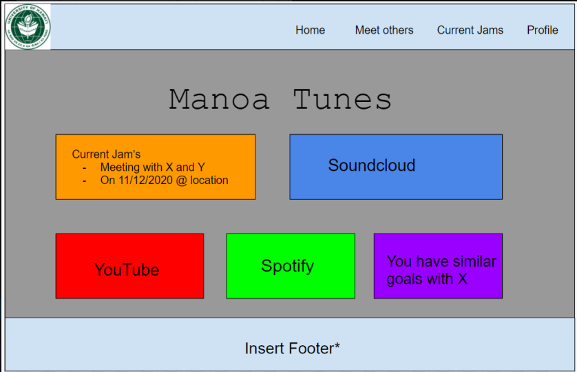

# Manoa Tunes 

Our project is intended to help students and faculty alike to connect to each other based on musical interests. Upon creating a profile, musicians and music enthusiasts are asked what they are looking for in the music world. Based on key words, others' profiles will be filtered based on the interests they share with you, and you will be able to add them. For musicians, there will be options for you to share your works of art with everyone else via embedding links of your creations onto your profile!

## Meet the Team:

Cheolhoon Choi <[https://cheolhoon.github.io](https://cheolhoon.github.io)>.  

Henry Cheung <[https://khhc.github.io](https://khhc.github.io)>.  

Michael Hui <[https://huimichael.github.io/](https://huimichael.github.io/)>.  

Timothy Huo <[https://timothyhuo1.github.io](https://timothyhuo1.github.io)>.  

## Landing Page:
This is a mockup design for our Manoa-Tunes website.

