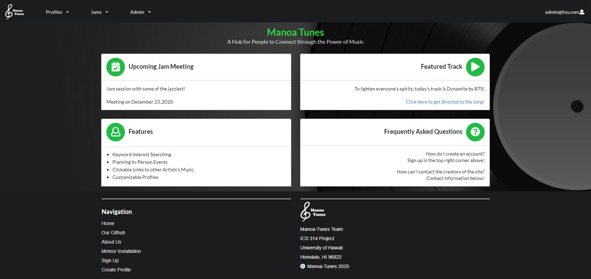

# Table of Contents

* [Manoa Tunes](#manoa-tunes)
* [Meet the Team](#meet-the-team)
* [Approach](#approach)
* [Pages](#pages)
* [Milestones](#milestones)

# Manoa Tunes 

[Manoa Tunes Website](https://manoa-tunes.github.io/)  

[Github Repo](https://github.com/manoa-tunes/manoa-tunes)  

_Problem_: Jam sessions are essential to experience musical creativity. Having such sessions give birth to the feeling of performing in a musical group. In UH Manoa there are many students who want to express that musical talent and creativity but do not have an opportunity or an easy way to do so.

_Solution_: Our project is intended to help students and faculty alike to connect to each other based on musical interests. Upon creating a profile, musicians and music enthusiasts are asked what they are looking for in the music world. Based on key words, others' profiles will be filtered based on the interests they share with you, and you will be able to add them. For musicians, there will be options for you to share your works of art with everyone else via embedding links of your creations onto your profile!

## Meet the Team:

[Cheolhoon Choi](https://cheolhoon.github.io)  

[Henry Cheung](https://khhc.github.io)  

[Michael Hui](https://huimichael.github.io/)  

[Timothy Huo](https://timothyhuo1.github.io)  

## Approach: 
Students are able to filter their interests and goals to find other musicians.   
Admins can monitor the site for inappropriate content, and create new categories for interest and goals.   
 
## Pages:
These are the designs showcasing each page we have on Manoa-Tunes.

### Landing Page:
Visiting the website, this page will [display](https://manoatunes.xyz/#/):  

### Register Page:
To make an account, click the [Sign Up](http://178.128.0.163/#/signup) link:  

### Sign-In Page:
Click the [Sign In](http://178.128.0.163/#/signin) link to sign in:  

### Profile Page:
After logging in, there are options to customize profile (Note: Currently under development, this is a mockup):  

### Admin Page:
There is an "[Admin](http://178.128.0.163/#/)" mode that will allow those with the Admin role to view all profiles and current jams:  

## Milestones: 

### Milestone-1
In our first milestone, we came up the mock-up pages and functions needed for our website. We began to researching what interests and goals that one might have to create a useful platform for everyone. Also, deployed our website with DigitalOcean. Here is our [Milestone-1](https://github.com/manoa-tunes/manoa-tunes/projects/1).  

### Milestone-2

For our second milestone, we are focusing on developing our mock-up pages and functions. Here is our [Milestone-2](https://github.com/manoa-tunes/manoa-tunes/projects/2).

