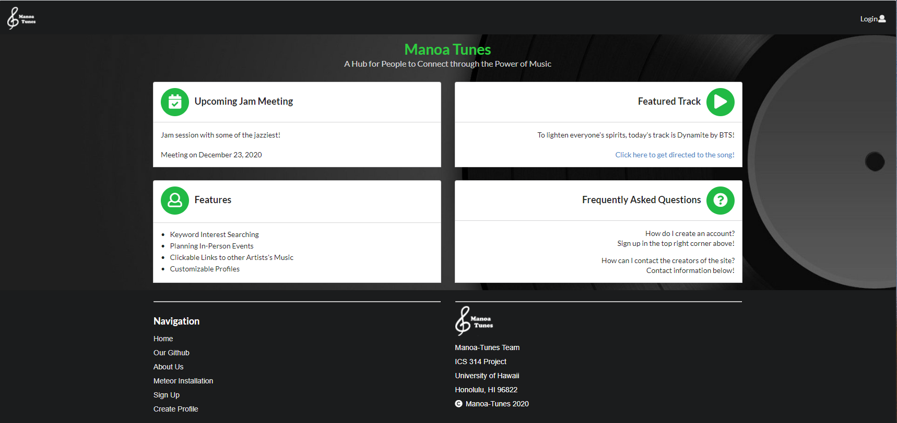
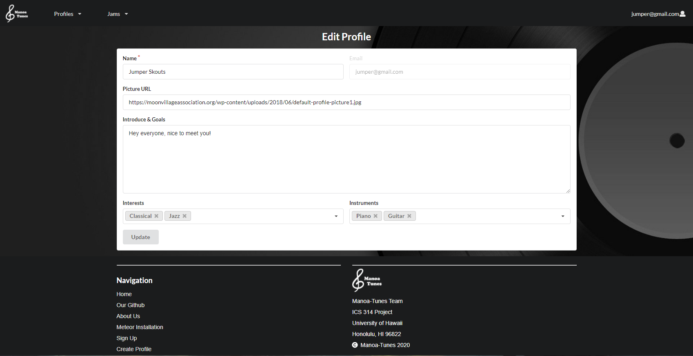
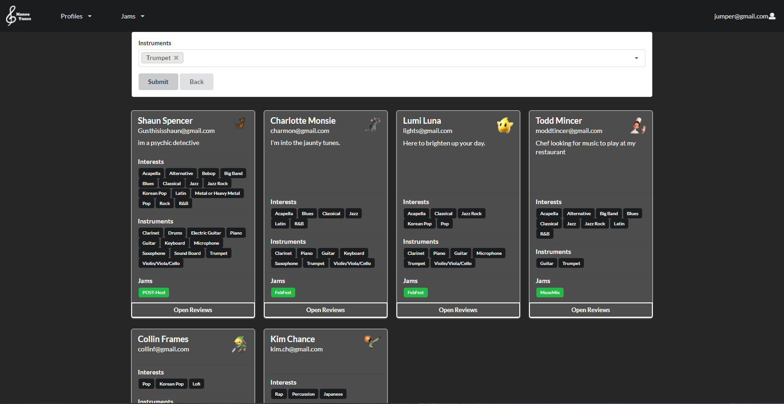
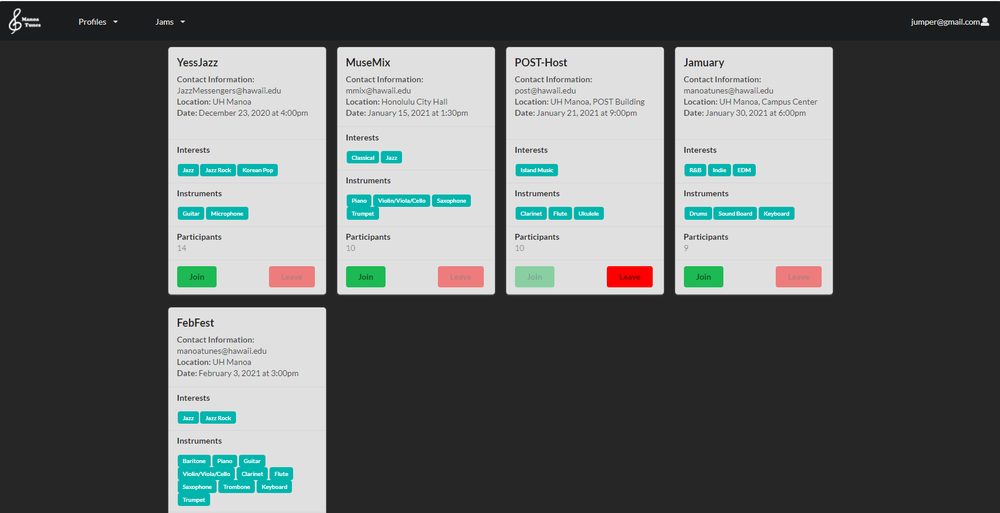
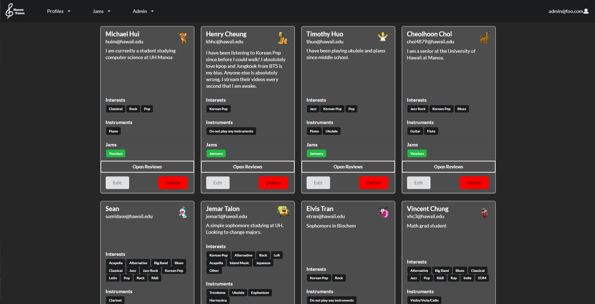
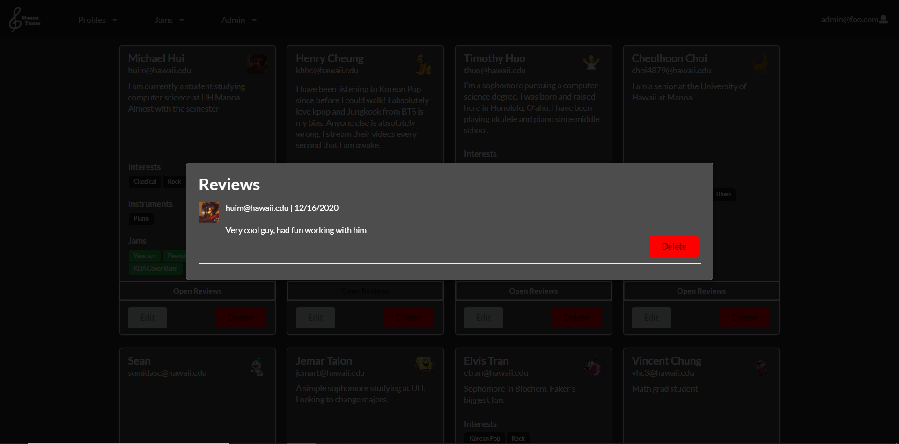
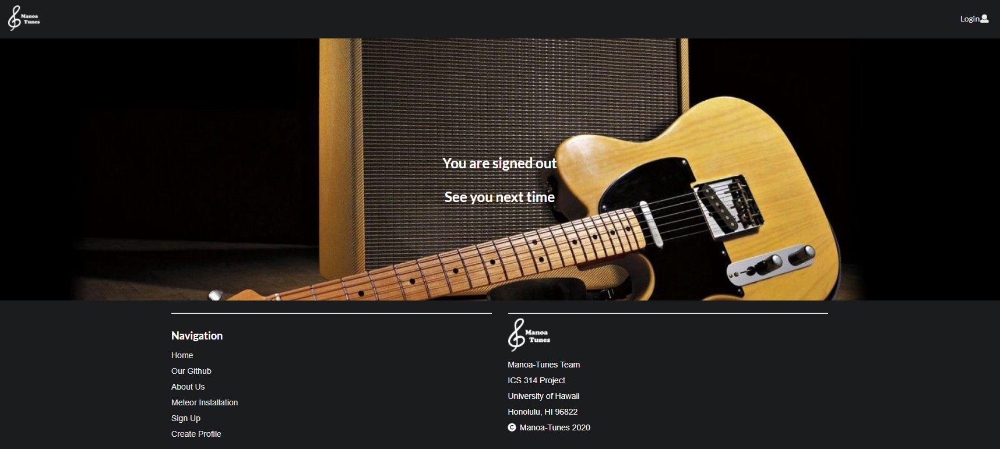
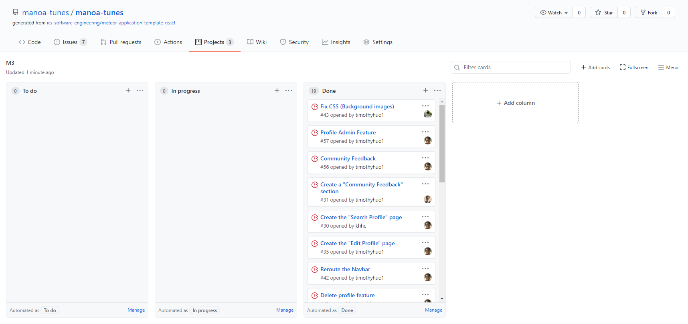

# Table of Contents

* [Manoa Tunes](#manoa-tunes)
* [Approach](#approach)
* [Developer Guide](#developer-guide)
* [Pages](#pages)
* [Milestones](#milestones)
* [Community Feedback](#community-feedback)
* [Meet the Team](#meet-the-team)

# Manoa Tunes 

See our deployed Website: [Manoa Tunes Website](http://159.65.68.217/) <br />

Find the Github Repo here: [Github Repo](https://github.com/manoa-tunes/manoa-tunes) <br />

_Problem_: Jam sessions are essential to experience musical creativity. Having such sessions give birth to the feeling of performing in a musical group. In UH Manoa there are many students who want to express that musical talent and creativity but do not have an opportunity or an easy way to do so.

_Solution_: Our project is intended to help students and faculty alike to connect to each other based on musical interests. Upon creating a profile, musicians and music enthusiasts are asked what they are looking for in the music world. Based on key words, others' profiles will be filtered based on the interests they share with you, and you will be able to add them. For musicians, there will be options for you to share your works of art with everyone else via embedding links of your creations onto your profile!

## Approach: 
Students are able to filter their interests and goals to find other musicians. <br /> 
Admins can monitor the site for inappropriate content, and create new categories for interest and goals. <br /> 

## Developer Guide: 

### Installation

First, [install Meteor](https://www.meteor.com/install).

Second, download [Manoa Tunes](https://github.com/manoa-tunes/manoa-tunes.github.io), and request permission to gain access to Manoa Tunes. 

Third, cd into the app/ directory and install required libraries: meteor:

```
$ meteor npm install
```

### Running the system

After installation, you can run the application by typing:

```
$ meteor npm run start
```
The first time running the application will add default users: 

```
meteor npm run start

> meteor-application-template-react@ start /Users/name/Desktop/manoa-tunes/app
> meteor --no-release-check --exclude-archs web.browser.legacy,web.cordova --settings ../config/settings.development.json

[[[[[ ~/Desktop/name/manoa-tunes/app ]]]]]

=> Started proxy.                             
=> Started MongoDB.                           
W20201107-10:04:03.241(-10)? (STDERR) Note: you are using a pure-JavaScript implementation of bcrypt.
W20201107-10:04:03.305(-10)? (STDERR) While this implementation will work correctly, it is known to be
W20201107-10:04:03.306(-10)? (STDERR) approximately three times slower than the native implementation.
W20201107-10:04:03.306(-10)? (STDERR) In order to use the native implementation instead, run
W20201107-10:04:03.306(-10)? (STDERR) 
W20201107-10:04:03.307(-10)? (STDERR)   meteor npm install --save bcrypt
W20201107-10:04:03.307(-10)? (STDERR) 
W20201107-10:04:03.308(-10)? (STDERR) in the root directory of your application.
I20201107-10:04:05.798(-10)? Creating the default user(s)
I20201107-10:04:05.798(-10)?   Creating user admin@foo.com.
I20201107-10:04:06.202(-10)?   Creating user john@foo.com.
I20201107-10:04:06.523(-10)? Creating default contact.
I20201107-10:04:06.523(-10)?   Adding: Johnson (john@foo.com)
I20201107-10:04:06.560(-10)?   Adding: Casanova (john@foo.com)
I20201107-10:04:06.565(-10)?   Adding: Binsted (admin@foo.com)
I20201107-10:04:06.721(-10)? Monti APM: completed instrumenting the app
=> Started your app.

=> App running at: http://localhost:3000/
```

Ignore "bcrypt warning": Bcrypt is used for password checking and it is safe to ignore the warning during development stages.

## Pages:
These are the designs showcasing each page we have on Manoa-Tunes.

### Landing Page:
Upon entering the site, you will be greeted with this [display](http://159.65.68.217/#/). On this page, as well as the other ones on this site, you will find a navigation header with various tabs that you can jump to. For this page, this includes the Manoa Tunes logo on the top-left, which from any page, will redirect you back to the landing page. The "login" option on the top-right will prompt a small menu giving you the option to either sign in or sign up.

The main area of the site features several bits of information about this site, such as an upcoming jam, the track of the day, notable features of the site, and any questions you may come across.

For more information about the site, or the makers behind the site, you'll find all of that and more at the footer! <br />



### Register Page:
To make an account, click the [Sign Up](http://159.65.68.217/#/signup) link: <br />


### Sign-In Page:
Click the [Sign In](http://159.65.68.217/#/signin) link to sign in: <br />


### Profile Page:
After logging in, users will notice that two new tabs have appeared on the NavBar. On the Profiles tab, users will be able to view their profile by clicking on "Your Profile." On this page, users will see their profile card, as well as the options to edit and delete their profile. In editing, users will be able to update anything to share a little but about yourself with the community, as well as name your musical interests, talents, and even works that you took part in creating! Upon creating or joining a Jam, those will also be featured here as well. <br />




### All Profiles
The other option in the Profiles tab is "All Profiles" where you will get to see the profiles of everyone else who made an account with Manoa Tunes. Here, you can search by keywords interests, for instruments, music tastes, and jams! Searching is keyword inclusive, so all profiles that even one keyword applies to will show. Additionally, other community members will be able to leave reviews of their fellow Manoa Tunes peers, whether on their music, or even how a Jam went! This is essentially the hub for meeting new people and sharing your works with the Manoa Tunes community!





### Adding and Joining Jams:
The other tab in the NavBar features the Jams of the website. In the "Create Jam" option, users have the ability to create a Jam, where the creator can schedule a meetup for musicians and music enthusiasts alike to participate in. Other users also have to ability to join and leave these communities. The other option in the Jams tab is "All Jams." Here, you can see all the Jams made by other members of the community. Each Jam card features information about the Jam, as well as the amount of attendees. Users will be able to join or leave a jam. Of course, users cannot leave a Jam they are not in, nor join a Jam they are already in!




### Admin Page:
There is an "[Admin](http://159.65.68.217/)" mode that will allow those with the Admin role to view all profiles and current jams. In the new Admin tab, Admins will be able to modify any profiles or jams should they see anything violating the rules of Manoa Tunes. If necessary, admins also have permissions to delete any profiles, jams, or comments after several warnings of malicious behavior. <br />







### Logging Off
We thank you for experiencing Manoa Tunes. We've even made a nice page for when you log off. We hope to see you next time you're in the mood to jam!



## Milestones: 

### Milestone-1
In our first milestone, we came up the mock-up pages and functions needed for our website. We began to researching what interests and goals that one might have to create a useful platform for everyone. Also, deployed our website with DigitalOcean. Here is our [Milestone-1](https://github.com/manoa-tunes/manoa-tunes/projects/1). <br />


### Milestone-2
For our second milestone, we spent some times revamping our pages from Milestone 1 to have a more user-friendly interface. We added the ability for users to create a profile, as well as created a page for updating their profile. We have entered a sample database of about 30 entries for now. Here is our [Milestone-2](https://github.com/manoa-tunes/manoa-tunes/projects/2).


### Milestone-3
For our third and last milestone, we are polishing the website and add more design and features to make it stand out. We added features such as creating and joining jams. Also, we worked on the admin pages, allowing admins more power in jams, profiles, and reviews. Here is our [milestone-3](https://github.com/manoa-tunes/manoa-tunes/projects/3).



## Community Feedback:
Here what some people had to say about our site below!

> Manoa Tunes is a user friendly website in which I can find others who have a passion for music while also putting myself out there. The functionalities for my profile and seeing others simple and easy to navigate to. This is the same with the "Jams", I was able to easily know quick info about individuals and jams through their tags. Creating my own Jam was as easy as creating my own profile, leaving and joining jams were just as easy. As an admin I had an easy time removing individuals or editing profiles that were inappropriate. Besides a bit of front end ui inconsistencies, the website provided everything I would want in meeting other musicians while also being easy to use.

-- Justin Wong, Information and Computer Sciences

> I like the design,it makes navigation and reading things really easy to understand. For hyperlinks that redirect you to another website (i.e. youtube, github, etc.), I wish that it would open up a new tab instead so I can continue scrolling through the website without pressing the "previous page" option on my browser. Clicking "Home" gives me a "your connection is not private" screen. For the Jams with the "Join" and "Leave" options, it would be nice to have in indication which Jams I am already in. Maybe like a green box in the top right saying "Joined" and a checkmark or something.

-- Ethan Chee, Computer Engineering

> Overall, I think the website and UI is amazing. It has a very simplistic design and the website is easy to navigate. The website is very well organized being able to look at web pages with just a click of a button. I love that every profile has a randomly generated character and a neatly formatted interest and jams. The Jam’s feature does a great job allowing people to create their own jams giving others the option to either join or leave them. As for some suggestions, I would maybe add a search bar on the home page so it can be easier for people to look for a specific person or specific jam. Another suggestion would be to allowing typing when you are using the filter as if more options were added in the future, it would be easier to find what you want rather than scrolling through the filter.

-- Brandon Au, Computer Engineer

> I love how simplistic creating profiles and jams are. All functionality that you expect to work does indeed work. I recommend adding a "back to top" button so users don't have to scroll back to the top. It would also be nice if users are able to edit Jams. A question I had after testing the site was if jams delete themselves after their date passes? If not, it would be a good feature to do so.

-- Jemar Talon, Information and Computer Sciences

> This site is well made. I feel as though the simplicity of the site compliments its straightforward purpose. The options for detailing your profile are very customizable. However, an option should be given to further detail the "Other" options. Also, the menu for creating a Jam does not expand enough to account for the possibility of including every single option.

-- Anthony Liu, Biochemistry


## Meet the Team:

[Cheolhoon Choi](https://cheolhoon.github.io) <br />

[Henry Cheung](https://khhc.github.io) <br />

[Michael Hui](https://huimichael.github.io/) <br />

[Timothy Huo](https://timothyhuo1.github.io) <br />


